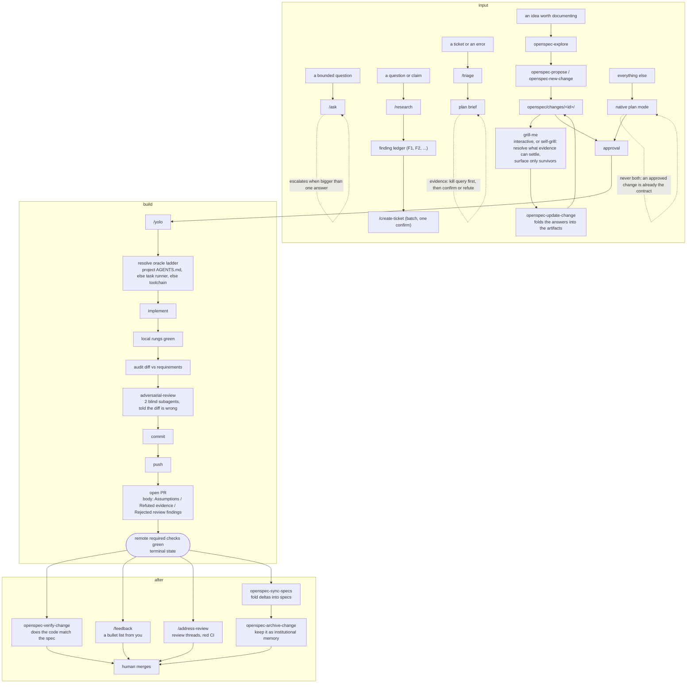

# AI agents

Shared Claude Code and OpenCode commands, skills, and instructions.

## Lifecycle



At any point the escalation contract can stop the run: three failures under three
different fixes, two attempts with no new information, a diff far past the implied
size, evidence contradicting the premise, or a first touch of a migration, CI
config, lockfile, shared contract, infrastructure, or auth surface that the
request did not name.

## Layout

- `commands/` - shared `/address-review`, `/ask`, `/create-ticket`, `/feedback`, `/research`, `/triage`, and `/yolo` commands
- `skills/` - Agent Skills loaded on demand by both harnesses
- `AGENTS.md` - global instructions, linked as Claude Code's `CLAUDE.md` and OpenCode's `AGENTS.md`

Commands are reachable only as `/name`; unlike skills they are never auto-invoked by description matching. `AGENTS.md` therefore carries an intent-routing table so a naturally phrased request still follows the workflow designed for it, with that workflow's gates intact.

The setup scripts link the same command and skill directories into both harnesses. There are no copied wrappers, custom subagent definitions, custom tools, or search plugins; the only custom agent is the OpenCode Ollama primary profile.

Two routes reach an agreed contract, and `AGENTS.md` picks between them: the `openspec-*` skills when the reasoning is worth keeping after the PR merges, native plan mode otherwise. Never both, since an approved OpenSpec change is already the contract and re-planning it just adds a second gate over the same decisions. No custom `/plan` command shadows native plan mode.

The OpenSpec skills come from https://github.com/Fission-AI/OpenSpec and are tracked in `skills-lock.json` like any other upstream skill. They shell out to the `openspec` CLI, which the setup scripts install with bun. `release-openspec` is deliberately not installed: it releases the OpenSpec project itself. `openspec-apply-change` is installed but never routed to, because implementation goes through `/yolo`, which is what carries the oracle ladder, adversarial review, and the escalation contract.

Agent-initiated review is adversarial: `adversarial-review` is the protocol, `caveman-review` is only the comment format. Human-requested review uses the harness's native review command, never a workflow.

The upstream `code-review` skill remains vendored but nothing routes to it, and because it is hash-locked its auto-trigger phrases cannot be disabled in place without breaking the lock. Treat `AGENTS.md`'s routing prohibition as the control. Delete the skill with its lock entry if it ever fires unbidden.

## Global versus project

`AGENTS.md` holds contracts, shapes, classes, and protocols, and must stay project-agnostic. Concrete commands, paths, provisioning, and available data sources belong in each repository's own `AGENTS.md` and worktrunk project config. Where a project declares nothing, a workflow infers it and records what it inferred, so a wrong guess is visible rather than silent.

This is what lets the same harness serve a large monorepo and a small side project in another language. A project with no telemetry, tracker, or CI degrades gracefully: runtime claims are marked unchecked, and the oracle ladder shortens rather than failing.

## No orchestration layer

A session already starts inside a worktree with an agent running, and the model can spawn subagents itself, so parallelism and supervision are prompt-level concerns. There is deliberately no scheduler, daemon, queue tool, or fan-out script here: the loop lives in `AGENTS.md`, the commands, and the skills.

Where per-stream state is needed, worktrunk already provides it. CI and review state ride on its PR object (`ci.ci_status`, `ci.review_state`) via `wt list --full`; escalation and attempt counts live in its per-branch vars (`git config worktrunk.state.<branch>.vars.*`), which survive an agent restart because they are stored in `.git`. Vars are used rather than the activity marker, because a marker is rewritten on every prompt and would erase an escalation.

Creating a stream needs no tooling of its own: `wty <branch> -- '<intent>'` makes a provisioned worktree and hands the terminal to an agent in one step.

Do not enable the worktrunk Claude Code plugin: its `UserPromptSubmit` hook writes the same per-branch marker slot an escalation would use.

## Skill updates

Upstream skills are tracked in `skills-lock.json`. The `.agents/skills` link exposes the existing shared skill directory to `skills.sh`; Claude Code and OpenCode continue loading that directory through their setup links.

Review upstream changes before committing them, then update project skills with:

```sh
npx skills@1 update --project --yes
```

Never edit a locked skill body in place, or the next update will report drift or clobber the edit. A locked skill may only be deleted, along with its lock entry, or wrapped by local policy in `AGENTS.md`.

`adversarial-review`, `evidence`, and `grill-me` are maintained locally and are not in the lock file. `grill-me` was unlocked deliberately: its upstream body was a one-line pointer to a command that does not exist.

There is no progress-tracking skill and no `AGENT_PROGRESS.md`. Run state is derivable from cheaper sources that cannot go stale: the oracle ladder says what is still failing, `git log` says what landed, `wt config state vars` holds attempts and escalations in `.git`, and a `tasks.md` in an OpenSpec change directory carries the checklist for specced work.

## Authentication

Authenticate each harness independently:

```sh
claude
opencode auth login
```

Use Claude Code directly for a Claude Pro/Max subscription. Do not route its OAuth credentials through OpenCode.

Configure MCP servers manually in each harness. OpenCode's public configuration is tracked under `opencode/`; credentials and generated runtime state stay machine-local. See `opencode/README.md`.

OpenCode documentation:

https://opencode.ai/docs/config/

https://opencode.ai/docs/mcp-servers/

Claude Code documentation:

https://code.claude.com/docs/en/mcp

## Ollama

Select the `ollama` primary profile instead of only switching the model. The profile uses `ollama/gemma4:e4b-mlx`, blocks delegation, and denies the current `linear_*` and `posthog_*` MCP tools so their schemas do not consume the local model's context.

When adding another OpenCode MCP server, also add its `<server-name>_*` deny rule to the `ollama` profile in `opencode/opencode.json`.
