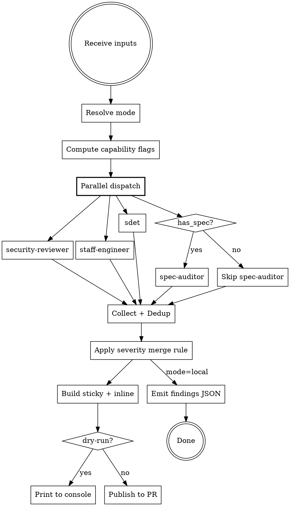
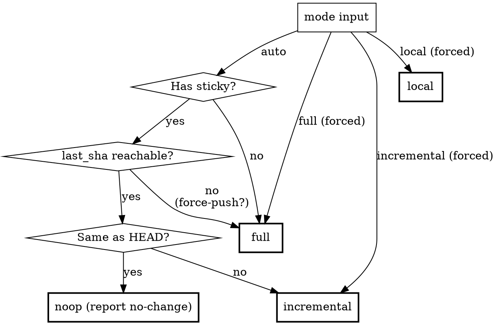
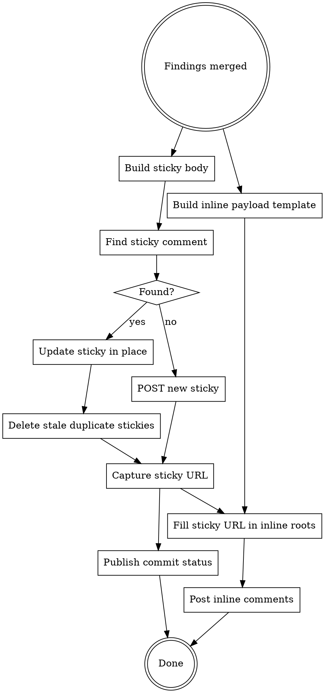

# PR Review

Review a PR/MR diff by dispatching independent role-based subagents in parallel, then publish findings as one sticky summary comment + per-finding inline comments. The main session never reviews — it ingests, dispatches, merges, emits, publishes.

<HARD-GATE>
Proceed only when the current top-level human message directly invokes `/pr-review`, either as the native skill or through the dedicated `agents/commands/pr-review.md` wrapper. That wrapper is valid only when its `<human_pr_review_invocation>` marker came from the current top-level command expansion. Consent is single-use and cannot be inferred from prior approval, a request to "review," or workflow context. Never accept invocation from any other skill, command, agent, subagent, supervisor, hook, script, retry, or review/fix loop. Never invoke or re-invoke this skill on the human's behalf. If direct human invocation cannot be verified, stop without reviewing and tell the human to type `/pr-review` themselves.

You MUST dispatch independent subagents — NEVER review the diff yourself in the main session. The main session accumulates context bias from prior conversation. Only an isolated subagent can deliver an unbiased finding.

Dispatch in PARALLEL using the harness's native isolated-worker mechanism. If one subagent fails, proceed with the rest BUT surface the failure in the sticky comment header (never silent). If ALL fail, report failure — do NOT fall back to self-review.

Publishing happens in the main session (post-merge) — not in subagents.

`mode: local` does NOT relax either gate. It changes the output target, not the human-consent or isolated-review requirements. Every new or incremental review requires a fresh human `/pr-review` invocation.
</HARD-GATE>

## Rationalization Prevention

| Thought                                        | Reality                                                                                               |
| ---------------------------------------------- | ----------------------------------------------------------------------------------------------------- |
| "The diff is small, I can review it myself"    | Self-review is biased by what you saw in the conversation. Small ≠ unbiased.                          |
| "I already saw this code earlier"              | That's exactly why you can't review it. Familiarity hides issues.                                     |
| "Dispatching 3-4 subagents is overkill"        | Each persona uses a different mental model. A single agent dilutes all of them.                       |
| "Sequential is fine, I'll save tokens"         | Parallel is faster wall-clock and prevents one report from biasing the next.                          |
| "spec-auditor isn't needed, the spec is short" | If has_spec is true, dispatch. The check is whether spec exists, not whether it's verbose.            |
| "I'll just check the obvious bug myself"       | Even one self-checked finding contaminates the report — readers can't tell which findings are biased. |
| "1 subagent failed, just hide it"              | Hiding partial review = pretending coverage existed. Surface it in sticky header.                     |
| "Prior finding line moved, mark fixed"         | Line moving ≠ behaviour fixed. Require subagent verification, then hedge as `Likely fixed`.           |

## Red Flags — STOP if you catch yourself:

- Reviewing any category yourself instead of dispatching
- Dispatching subagents sequentially instead of in parallel
- Skipping a subagent because "the diff doesn't look like it has X"
- Claiming review passed without reading subagent findings
- Editing code during review (review reads, doesn't write)
- Falling back to self-review because a subagent failed
- Hiding subagent failures in output (must surface in sticky header)
- Marking prior findings as `✅ Fixed` without a verification note from subagent
- Publishing inline comments before merging findings (dispatch → merge → publish)

<decision_boundary>

**Use for:**

- Reviewing a PR/MR diff and producing structured findings
- Security / logic / performance scans on code changes
- Spec compliance verification when spec exists
- Organizing findings with severity + blast radius + confidence
- Posting findings to the PR/MR as sticky summary + inline comments

**NOT for:**

- Writing or improving PR descriptions
- Design review requiring business judgment about scope or direction
- Writing the actual code/diff
- Deep CVE / supply-chain / OWASP sweep
- Writing release notes / CHANGELOG
- End-user / UX review (use /qa or /design-review)
- Auto-approving or auto-merging (produce findings only; humans merge)

</decision_boundary>

## Flow



## Inputs

### Required

**`pr`** — `<owner>/<repo>#<N>` or a full PR/MR URL (GitHub PR, or GitLab `/-/merge_requests/<iid>`). Used for platform detection, sticky lookup, and publishing — see [Platform](#platform). No implicit branch-based detection (too brittle).

> **Exception**: `mode: local` does not require `pr` (no remote side effects). See [Local Mode](#local-mode).

### Optional

**`mode`** — `auto` (default) / `full` / `incremental` / `local`. See [Mode Detection](#mode-detection) and [Local Mode](#local-mode).

**`dry-run`** — `true` / `false` (default `false`). When true, builds sticky + inline payloads and prints to console; no remote API writes (GitHub/GitLab).

**`base`** — base git ref for diff scope (e.g. `origin/main`). Used by **local mode only** — replaces the sticky/PR-based base lookup. Ignored for other modes (they derive base from the PR or repo state).

**`last_sha`** — prior reviewed HEAD commit. Used by **local mode only** for incremental review. In non-local modes the last_sha lives in the sticky body; local mode has no sticky, so the human must pass it explicitly in a fresh `/pr-review` invocation.

**`spec`** — source of the spec / design doc. Sets `has_spec` flag.

- Path: `spec: docs/specs/payment-v2.md`
- URL: `spec: https://confluence.example.com/payment-v2`
- Inline: `spec: this PR implements PCI DSS v4.0 logical isolation`
- Multiple: `spec: design doc at X, acceptance criteria in Jira ABC-123`

If absent → spec-auditor not dispatched. Other subagents do not reference spec.

**`test direction`** — tells sdet how to evaluate test coverage. All sub-fields optional:

- **Approach**: `unit only` / `integration required` / `e2e required` / `no test needed`
- **Location**: expected test file path
- **Focus**: scenario or case the test should cover

Missing → sdet uses heuristic from diff nature.

**`context`** — free-form supplementary signals:

- **Business risk**: "this endpoint is internal-admin only"
- **Domain rules**: "tenant_id is required"
- **Known trade-offs**: "we're aware of the N+1, will fix next sprint"
- **Environment constraints**: "CDE service, security findings cannot be downgraded"
- **Hotfix narrowing**: "hotfix — only check critical security"
- **Cross-PR coupling**: "ships together with PR #1234"

Context can adjust severity at merge time (see Severity Merge Rule).

**`repo rules`** — compact repo-specific review constraints sourced from committed project files, not from conversation memory. Use this when a repo has hard invariants, ADRs, testing conventions, glossary terms, module READMEs, or accepted design trade-offs that reviewers must respect.

Examples:

- "ADR-0016: Slack is single-workspace; do not require workspace isolation in this PR."
- "DB migrations are forward-only expand/contract; migration SQL must have artifact-backed coverage."
- "E2E step definitions must not use networkidle or raw sleeps."
- "MCP default-all is a UI default, not a server-side create contract."

Repo rules are review inputs, not output metadata. Do **not** add a "rules source" / "review inputs" section to the sticky.

## Platform

`pr-review` publishes to **GitHub** (via `gh`) or **GitLab** (via `glab`). Resolve `$PLATFORM` before Mode Detection — it selects every discovery and publish endpoint below. Both platforms use the same sticky/inline markers (HTML comments render in either markdown), so only the transport differs.

### Detection

- `pr` is a full URL → inspect host + path:
  - host `github.com`, or path contains `/pull/` → `gh`
  - path contains `/-/merge_requests/` → `glab`
- `pr` is `<owner>/<repo>#<N>` shorthand (no host) → detect from `git remote get-url origin`: `github.com` → `gh`; any other host → `glab`.
- Self-hosted GitLab: derive the host from the MR URL (or `git remote get-url origin`) — **never hardcode a hostname** — and pin `glab` to it (see [glab auth](#glab-auth) below). `glab` does **not** infer the host from the token.

### glab auth

`glab` defaults to `gitlab.com`. An ambient `GITLAB_TOKEN` is applied to whatever host `glab` targets — it does **not** redirect `glab` to a self-hosted instance — so `glab api` silently 401s against e.g. `gitlab.example.com`. When `glab` fails auth, a session tends to improvise `curl` fallbacks with hand-rolled sticky parsing; that improvised discovery misses the existing sticky → full re-scan + duplicate sticky (the exact failure this skill exists to eliminate). Prevent it: **pin the host and assert auth before any `glab` call, and abort — never `curl`-improvise — if it fails.**

Shell env does **not** persist across separate tool-call invocations, so set `GITLAB_HOST` **inside each bash block** that calls `glab` (the Mode Detection discovery block and the Publishing block below both do this):

```bash
export GITLAB_HOST="<host parsed from the MR URL — NOT hardcoded>"   # e.g. gitlab.example.com
glab api user >/dev/null 2>&1 || {   # authenticated probe — glab api uses $GITLAB_HOST + $GITLAB_TOKEN
  echo "pr-review: glab not authenticated for $GITLAB_HOST — ABORT (do NOT fall back to curl)." >&2
  echo "  fix: provide GITLAB_HOST + GITLAB_TOKEN in the run env, or 'glab auth login --hostname $GITLAB_HOST'." >&2
  exit 1
}
```

On abort, report the auth failure to the human; do **not** proceed with a `curl` fallback.

### Identifiers

| | GitHub | GitLab |
| --- | --- | --- |
| Repo / project | `$OWNER/$REPO` | `$PROJECT` = URL-encoded `namespace/path` (`/` → `%2F`) |
| PR / MR number | `$N` | `$IID` (the MR number) |
| Inline diff anchors | n/a | `$BASE` / `$START` / `$HEAD` from `glab api projects/$PROJECT/merge_requests/$IID` → `.diff_refs` |

### Endpoint adapter

| Operation | GitHub (`gh api`) | GitLab (`glab api`) |
| --- | --- | --- |
| Find sticky | `repos/$OWNER/$REPO/issues/$N/comments` | `projects/$PROJECT/merge_requests/$IID/notes?per_page=100` |
| Create sticky | `-X POST .../issues/$N/comments` | `-X POST .../merge_requests/$IID/notes` |
| Update sticky **in place** | `-X PATCH .../issues/comments/$ID` | `-X PUT .../merge_requests/$IID/notes/$ID` |
| Delete stale sticky | `-X DELETE .../issues/comments/$ID` | `-X DELETE .../merge_requests/$IID/notes/$ID` |
| Commit status | `-X POST .../statuses/$HEAD -f context=pr-review` | `-X POST .../statuses/$HEAD -f name=pr-review` |
| Inline comment | one review: `-X POST .../pulls/$N/reviews` (batched) | one discussion **per finding**: `-X POST .../merge_requests/$IID/discussions --input <json>` |

GitLab specifics that bite (verified against a live MR):

- **`glab` must be authenticated for the MR's host.** Self-hosted defaults to `gitlab.com` and the token env alone does not redirect it; set `GITLAB_HOST` per bash block and assert glab can authenticate (`glab api user`), then abort on failure — see [glab auth](#glab-auth). An unauthenticated `glab` pushes the session into `curl` improvisation whose discovery misses the existing sticky → full re-scan + duplicate sticky.
- **Sticky must be edited in place** with `PUT .../notes/$ID`. Posting a fresh note every run is exactly what makes incremental detection fail (multiple stickies, no canonical `last_sha`).
- **Inline position must travel as a JSON body** via `--input`. Passing `-f "position[...]"` form flags is silently dropped and the note lands un-anchored as a plain `DiscussionNote` instead of a `DiffNote`.
- **Commit status state token is `failed`** (GitHub uses `failure`); GitLab also has no delete-status API (a status is only superseded by a newer post on the same `name`).

## Mode Detection

Resolve before dispatch. The mode controls diff scope and output sections.

`mode: local` short-circuits this whole section — no sticky lookup, no SHA reachability check, no noop case. Diff scope comes from the `base` (and optional `last_sha`) inputs; see [Local Mode](#local-mode).



Sticky discovery (use the platform's "Find sticky" endpoint from [Platform](#platform)):

```bash
# GitHub
gh api repos/$OWNER/$REPO/issues/$N/comments \
  --jq '.[] | select(.body | contains("<!-- pr-review:sticky -->")) | {id, body}'
# GitLab — pin host + assert auth first (see § glab auth), then --paginate + `jq -s add`
# so an early sticky (kept at its original created_at by in-place edits) is still found once
# the MR passes 100 notes — GitLab returns notes newest-first.
export GITLAB_HOST="<host from the MR URL>"
glab api user >/dev/null 2>&1 || { echo "glab not authed for $GITLAB_HOST — ABORT, do not curl-improvise" >&2; exit 1; }
glab api --paginate "projects/$PROJECT/merge_requests/$IID/notes?per_page=100" \
  | jq -s 'add | [.[] | select(.body | contains("<!-- pr-review:sticky -->"))] | max_by(.id)'
```

When more than one sticky matches (legacy duplicates from older runs), the **newest (highest id)** is canonical — its body holds the authoritative `last_sha`. Publishing edits that one in place and deletes the rest (see [Publishing](#publishing)).

Markers embedded in sticky body:

- `<!-- pr-review:sticky -->` — locator
- `<!-- pr-review:sha=<commit> -->` — last reviewed HEAD

SHA reachability:

```bash
git cat-file -e <last_sha> 2>/dev/null && echo reachable || echo unreachable
```

If unreachable (force-push / squash-merge of older PR / branch rebased): fall back to `full` AND prepend to sticky body:

```markdown
> ⚠️ Prior review base `<last_sha>` is not reachable (force-push?). This iteration is a full re-review.
```

### Noop case (`last_sha == HEAD`)

When the sticky exists AND `last_sha == HEAD`: skip dispatch + publish. Print to console:

> `pr-review: nothing new since <last_sha>. Skipping. Type /pr-review mode: full to force a new review.`

The sticky is already current; do not touch it.

## Local Mode

Use only when the human directly invokes `/pr-review mode: local` for an unbiased pre-PR review of a local diff. Local mode may not be called by another skill, supervisor, or automated verification loop. The HARD-GATE still applies — local mode changes only the output target.

> **Caveat — calling from the same dev session that wrote the code (author-as-reviewer bias)**: pr-review's 4-subagent dispatch is isolated by design — finding generation is robust even when called from the author's session. **But the downstream `modify / wontfix / defer` verdict on each finding is NOT covered by this isolation.** If the same session that wrote the code also reasons about which findings to wontfix, author-narrative bias compounds — framing a diff as "bug-free" produces the strongest detection drop among framing conditions tested across 6 LLMs (Mitropoulos et al., *Measuring and Exploiting Contextual Bias in LLM-Assisted Security Code Review*, https://arxiv.org/abs/2603.18740). Treat local-mode findings as **advisory** in dev sessions; do **NOT auto-execute verdicts in the main session**.

### Inputs

- `mode: local` (required to enter this mode)
- `base: <ref>` (required — e.g. `origin/main`)
- `last_sha: <sha>` (optional — if provided, runs incremental on `<last_sha>..HEAD` and still reads `<base>...HEAD` for cumulative context that subagents need for prior-finding verification)
- `spec`, `test direction`, `context` — same semantics as default mode

`pr` is NOT required and ignored if provided.

### Diff scope

- No `last_sha` → full diff: `git diff <base>...HEAD` (three-dot — topic-only changes)
- With `last_sha` → incremental: subagents see both `<base>...HEAD` and `<last_sha>..HEAD`; they report findings only inside the incremental window plus verification status for prior findings (the human must pass prior findings too — see below)

### Human-provided state (incremental local mode)

The sticky normally carries prior findings between iterations. In local mode the human owns that state and must pass it with each fresh `/pr-review` invocation:

- `prior_findings`: array of objects with `{id, slug, file, line, category, severity, justification, summary}` — same shape as findings JSON output (see below)
- `prior_fix_range`: `<first-fix-sha>^..<last-fix-sha>` — the commits that addressed iter (N-1) findings, used by the threshold's drop signal (B)

If `last_sha` is set but `prior_findings` is missing → ask the human; do not fabricate or self-reinvoke.

### Output

Skip Publishing. Skip sticky/inline markdown construction. Emit one JSON document to stdout:

```json
{
  "mode": "local",
  "base": "origin/main",
  "head": "<HEAD sha>",
  "last_sha": "<sha or null>",
  "status": "PASSED | PASSED_WITH_NOTES | REVIEW_BEFORE_MERGE | BLOCKED | PARTIAL | NOOP",
  "status_heading": "✅ pr-review: PASSED | 🟡 pr-review: PASSED WITH NOTES | 🟠 pr-review: REVIEW BEFORE MERGE | 🔴 pr-review: BLOCKED | ⚠️ pr-review: PARTIAL",
  "open_counts": { "P0": 0, "P1": 0, "P2": 0, "Q": 0 },
  "subagent_failures": [],
  "next_action": "<one-line or null>",
  "findings": [
    {
      "id": "F1",
      "p_code": "P0 | P1 | P2 | Q",
      "severity_emoji": "🚨 | ⚠️ | 💡 | ❓",
      "slug": "kebab-case-slug",
      "category": "Original [code name] from subagent",
      "file": "path/to/file",
      "line_start": 42,
      "line_end": 42,
      "confidence": "high | medium | low",
      "blast": "Local | Module | Cross-service | Data layer",
      "justification": "Reachable | Precedent | Asymmetric | Historical",
      "failure_mode": "one-line",
      "mitigation": "one-line",
      "evidence": "verbatim diff line(s)",
      "details": "optional multi-line",
      "disposition": "open | likely_fixed | still_present | follow_up | wontfix | by_design",
      "accepted_exception": null | { "kind": "follow_up | wontfix | by_design", "reason": "...", "issue": "#123 or null" },
      "severity_adjustment": null | { "from": "💡 P2", "to": "⚠️ P1", "reason": "..." }
    }
  ],
  "accepted_exceptions": [
    { "finding_id": "F2", "kind": "follow_up | wontfix | by_design", "reason": "one-line", "issue": "#123 or null" }
  ],
  "spec_gaps": [
    {
      "id": "F7",
      "section": "spec section or decision id",
      "title": "one-line",
      "spec_quote": "verbatim",
      "code_quote": "verbatim",
      "questions": ["..."]
    }
  ],
  "prior_verifications": [
    {
      "prior_id": "F1",
      "verification": "yes | unclear | no",
      "note": "what evidence"
    }
  ],
  "checked_and_clean": [
    { "slug": "...", "evidence": "one-line" }
  ]
}
```

`severity_adjustment: null` when no adjustment; the merged severity is already reflected in `p_code` / `severity_emoji`. The adjustment field exists so callers can audit downgrades (same role as the sticky's `## ⚖️ Severity adjustments` section).

`prior_verifications` is empty `[]` when `last_sha` is absent.

### What local mode keeps from default mode

- HARD-GATE: still dispatch 4 parallel subagents; main session never reviews
- Capability flags (has_spec, has_repo, is_trivial)
- Finding Inclusion Threshold (Reachable / Precedent / Asymmetric / Historical + drop signals A/B/C/D)
- Severity Merge Rule (4 steps + P-code mapping)
- Dedup between subagent findings
- Subagent failure → if all 4 fail, report failure to the human; never self-review or retry without a fresh `/pr-review`

### What local mode drops

- Sticky comment build / markdown rendering
- Inline comment markdown / inline-endpoint call (`gh` review or `glab` discussions)
- Sticky discovery via `gh` / `glab`
- last_sha derivation from sticky body (the human passes it)
- Noop case (the human decides whether to type a new `/pr-review`; if `last_sha == HEAD`, return `findings: []` + a `status: "noop"`)

## Capability Flags

Compute before dispatch:

| Flag         | Default | Set when                                                          | Effect                   |
| ------------ | ------- | ----------------------------------------------------------------- | ------------------------ |
| `has_spec`   | false   | spec input present OR PR description has goal/requirement section | dispatch spec-auditor    |
| `has_repo`   | true    | repo access available (grep / index / LSP)                        | enable cross-file checks |
| `is_trivial` | false   | <50 LOC AND (docs-only OR pure rename OR pure type-only)          | skip staff-engineer      |

## Context Hydration

Before dispatch, build a compact context pack from durable inputs. This reduces false positives from reviewers missing accepted scope or repo rules, while preserving subagent isolation from conversation history.

Allowed sources:

- PR body sections: goal, scope boundary, explicitly out of scope, validation, alternatives, accepted follow-ups
- User-provided `spec`, `context`, `test direction`, and `repo rules`
- Beat change artifacts or ADRs explicitly linked in the PR body or user-provided spec/context
- Module README / repo instruction files selected by changed paths when the human provides them as `repo rules`

Do not include:

- Chat history, author explanations not recorded in durable artifacts, or ad hoc "the author probably meant" assumptions
- A sticky-visible "rules source" section. Context hydration is an input discipline, not PR output.

Subagents receive the compact context pack, but still emit findings only with quoted diff/spec evidence. Dispatcher uses the same pack for severity calibration, accepted-exception handling, and P0 conservatism.

## Dispatch

Default dispatch (4 subagents in parallel via a single message):

| Subagent          | Prompt file                   | When dispatched             |
| ----------------- | ----------------------------- | --------------------------- |
| security-reviewer | `security-reviewer-prompt.md` | always                      |
| staff-engineer    | `staff-engineer-prompt.md`    | always (skip if is_trivial) |
| sdet              | `sdet-prompt.md`              | always                      |
| spec-auditor      | `spec-auditor-prompt.md`      | only if has_spec            |

Each subagent receives:

- Diff (full in `full` mode; `<last_sha>..HEAD` in `incremental` mode)
- Capability flags (has_spec, has_repo, is_trivial)
- Mode (`full` / `incremental`)
- Compact context pack from [Context Hydration](#context-hydration)
- Role-specific inputs only where applicable (spec content for spec-auditor, test direction for sdet)
- In `incremental` mode (dispatcher MUST provide all three):
  - Prior findings JSON (subagent's own category scope only)
  - Prior `Checked & clean` slugs for drift spot-check
  - **`prior_fix_range`**: `<first-fix-sha>^..<last-fix-sha>` — git range covering the commits that addressed iter (N-1) findings. Subagent uses this to apply drop signal (B) self-introduced surface. In single-commit-per-iter cases this collapses to `<last_sha>..HEAD`. If the dispatcher cannot determine the range (e.g. force-push, squash-merge of iter N-1 commits) → fall back to `full` mode and announce in sticky; do NOT invoke incremental mode without `prior_fix_range`
- NO conversation history, NO session context, NO prior subagent findings from this run. Repo rules inside the compact context pack are allowed because they come from durable project artifacts or explicit invocation inputs.

**Threshold inlining**: the [Finding Inclusion Threshold](#finding-inclusion-threshold) is inlined directly in each subagent prompt (`security-reviewer-prompt.md` / `staff-engineer-prompt.md` / `sdet-prompt.md` / `spec-auditor-prompt.md`). Dispatcher does NOT need to prepend threshold text — subagents apply it from their baked-in section. This avoids relying on dispatcher's "good behavior" to inject the gate on every invocation.

### Incremental-mode subagent additions

In incremental mode, each subagent ALSO emits for every prior finding within its scope:

```
Prior finding status: <id>
verification: yes | unclear | no
note: <one-line — what evidence supports the verification>
```

Mapping to display status (in `## 🔄 Changes since last review` table):

| `verification` | Display                                                                 |
| -------------- | ----------------------------------------------------------------------- |
| `yes`          | ✅ Likely fixed `<sha>` — <verification note>                           |
| `unclear`      | ⏸️ Untouched — <note: "file segment not in diff">                       |
| `no`           | 🔄 Still present — <note: "evidence still observable at <file>:<line>"> |

**Never** emit `✅ Fixed` without `verification: yes`. Default hedge is `Likely fixed` always — finality belongs to the human reviewer.

### Fallback rules

- 1 subagent fails → continue with rest; sticky header shows `⚠️ Partial — <subagent> failed`
- 2+ fail → continue with surviving findings; sticky header shows `⚠️ Partial — N/4 subagents failed: <names>`
- ALL fail → report failure to user, do not publish, never self-review

## Subagent Finding Contract

Each subagent emits findings in this shape:

```
[<category-id> <category-name>] <file>:<line_start>-<line_end>
Severity: 🚨 | ⚠️ | 💡 | ❓
Confidence: high | medium | low
Blast: Local | Module | Cross-service | Data layer
Justification: Reachable | Precedent | Asymmetric | Historical

Evidence: <verbatim diff line(s) — cite-or-drop rule>
Failure mode: <one-line — what breaks if shipped as-is>
Mitigation: <one-line — fix action; cite test path when test coverage is part of the fix>
Details: <optional — multi-line narrative, repro steps, code patch. Use only when Failure mode genuinely needs more than one line>
Notes: <optional — only if severity differs from default>
```

**Field semantics**:

- `Failure mode` — concrete bug / breach / drift consequence. Forces severity calibration: if you cannot describe what goes wrong in one line, you do not have a finding.
- `Mitigation` — actionable fix. When the finding's resolution involves test coverage, name the test file and case (e.g. `add assert in foo_test.py:42 'rejects empty input' case`).
- `Details` — escape hatch for findings whose explanation cannot fit one line (e.g. multi-step race, cross-file impact chain). Keep `Failure mode` and `Mitigation` as one-liners regardless; put narrative here.
- `Justification` — required class declaring why the finding is worth emitting. See [Finding Inclusion Threshold](#finding-inclusion-threshold) below. Findings that cannot commit to one of the four classes MUST NOT be emitted as standalone findings; batch into a Q-class hygiene followup instead.

After findings, each subagent emits `N/A categories: [<list>]` declaring which of its owned categories were reviewed and clean. This distinguishes "checked, found nothing" from "skipped".

spec-auditor uses `Spec quote:` + `Code quote:` instead of single `Evidence:` — both must be verbatim quotes. `Failure mode` for spec findings = "what spec contract gets violated if shipped".

**Drop rule**: any finding without `Evidence:` (or both quotes for spec-auditor) is fabrication — discard before merge.

## Finding Inclusion Threshold

This gate is applied by each subagent inline before emitting a finding. **Canonical definition lives in the subagent prompts, not here** — see any of:

- `security-reviewer-prompt.md` § Finding Inclusion Threshold
- `staff-engineer-prompt.md` § Finding Inclusion Threshold
- `sdet-prompt.md` § Finding Inclusion Threshold
- `spec-auditor-prompt.md` § Finding Inclusion Threshold

All four contain the same Justification classes (Reachable / Precedent / Asymmetric / Historical), the same drop signals (A / B / C / D), and the same Asymmetric escape hatch. Per-prompt variations only add category-specific guidance (e.g. "most S1–S5 are Asymmetric" for security, "rare for T-class" for SDET).

**Why duplicated across four prompts rather than referenced from one source**: see [Design note: prompt inlining](#design-note-prompt-inlining-over-reference-indirection).

**Full vs incremental mode**: full mode applies the threshold but drop signal (B) self-introduced surface never fires (no `prior_fix_range` on iter 1). Incremental mode applies all four signals.

**Spec ambiguity rule** (applies only to spec-auditor's C-class findings, kept in this SKILL.md as cross-cutting): if a candidate finding's mitigation offers "add a code comment" / "document the limitation in a comment" as an **equal-weight** resolution (phrasing "either X or document Y"), the finding is a Q-class spec gap addressed to the spec author, not P-class actionable. A comment-as-last-resort **fallback** ("do X; if impractical, document Y") keeps the finding actionable — the primary mitigation is what gets judged.

## Severity Merge Rule (deterministic precedence)

Apply in fixed order to each finding. Lower number wins on conflict.

1. **Base severity** — assigned by subagent at finding emission (emoji form)
2. **Confidence demote** — `confidence: low` → demote to ❓ Question (terminal, no further escalation)
3. **Blast attention** — `blast: cross-service` or `blast: data-layer` raises review attention and can escalate P2→P1 when the failure is factual. It does **not** automatically escalate to 🚨 Blocker.
4. **P0 calibration** — final 🚨 / P0 requires the [P0 calibration](#p0-calibration) test: reachable now, severe/concrete, and must be handled in this PR.
5. **Context adjust** — overrides from context input, repo rules, accepted scope, or explicit design trade-offs applied last. Accepted follow-up / wontfix / by-design dispositions remove the finding from open blockers.
6. **Final severity** — result after all steps
7. **Map to P-code** for output (dispatcher does this; subagents emit emoji severity only):

| Emoji         | P-code | Label                        |
| ------------- | ------ | ---------------------------- |
| 🚨 Blocker    | **P0** | must fix; blocks merge       |
| ⚠️ Factual    | **P1** | should fix                   |
| 💡 Suggestion | **P2** | consider                     |
| ❓ Question   | **Q**  | clarify; not a priority tier |

Severity ordering (for sort): P0 > P1 > P2. Q is orthogonal.

Downgrades (step 5 lowering a tier) MUST appear in the `Severity adjustments` section. Never silent. Never collapsed behind `<details>` — render as plain section when any adjustment exists.

## Dedup (between subagent findings)

- Same `file:line` + same category → keep highest base severity, attribute to all reporting subagents
- Same issue described differently across subagents → merge into one finding with combined notes
- Cross-cutting (e.g. staff-eng AND sdet both flag missing test for SQL injection) → keep both, dispatcher cross-references

## Output Language

PR-published prose (sticky shape narrative, `Failure mode` / `Mitigation` / `Details` content, spec gap question body, verification notes, framing text around code refs) renders in the PR description's primary language. Everything else — markers, section titles, field labels, kebab-case slugs, P-codes, severity / justification / status tokens, the race meta tag — stays English.

Fallback when the PR description lacks substantive prose: linked issue body, then English.

Terminal / JSON output (`mode=local` JSON, dry-run console, noop message) stays English regardless of PR language — those go to callers, not the PR.

## Output Format

After subagent findings are merged, deduped, and severity-calibrated, produce three artifacts:

1. **Sticky comment** — a single comment on the PR/MR (GitHub issue comment / GitLab MR note); updated in place across iterations (same comment id). This is the canonical review summary.
2. **Commit status** — commit status named `pr-review` (GitHub `context` / GitLab `name`), visible in the PR/MR header / Checks area. Its `target_url` links to the sticky comment.
3. **Inline comments** — one root comment per P0 / P1 / P2 finding emitted in this iteration, anchored to the diff (GitHub: one batched review; GitLab: one discussion per finding — see [Platform](#platform)). Q findings stay in the sticky.

Status tier (drives sticky heading and commit status, NOT any actual approve/request-changes review event):

| Condition                                    | Sticky heading                         | Commit status |
| -------------------------------------------- | -------------------------------------- | ------------- |
| Any subagent failed                          | `⚠️ pr-review: PARTIAL`                | `failure`     |
| Any unaccepted P0                            | `🔴 pr-review: BLOCKED`                | `failure`     |
| No unaccepted P0, any unaccepted P1          | `🟠 pr-review: REVIEW BEFORE MERGE`    | `failure`     |
| Only unaccepted P2 / Q                       | `🟡 pr-review: PASSED WITH NOTES`      | `success`     |
| Zero unaccepted findings                     | `✅ pr-review: PASSED`                 | `success`     |
| Zero unaccepted findings + accepted exception | `🟡 pr-review: PASSED WITH NOTES`      | `success`     |

Accepted exceptions (`follow-up`, `wontfix`, `by-design`) do not count as open blockers after they are explicitly recorded in the sticky. The sticky status MUST be recalculated after every incremental review from current unaccepted findings plus accepted exceptions; never leave `BLOCKED` / `REVIEW BEFORE MERGE` visible after all P0/P1 findings have been accepted or verified likely fixed.

The skill **does not** submit `APPROVE` or `REQUEST_CHANGES` reviews. Status wording lives inside the sticky comment and commit status only. Auto-approve / auto-merge is forbidden.

### P0 calibration

Final P0 is reserved for findings that are all three:

1. **Reachable now** — current code path can produce the failure mode.
2. **Severe and concrete** — failure causes security breach, data loss/integrity break, unrecoverable workflow break, or equivalent critical impact.
3. **Must be handled in this PR** — not already an accepted out-of-scope item, follow-up, or design trade-off.

`Cross-service` or `Data layer` blast may escalate severity only when the three P0 conditions hold. Otherwise prefer P1 for factual defects, P2 for optional hardening, or Q for spec/design decisions. Downgrades caused by accepted scope or design context must be visible in `Accepted exceptions` or `Severity adjustments`.

### Summary line (top of sticky)

The first visible line of the sticky is always the status heading. Do not prepend bot attribution such as `Automated review by pr-review skill`. The reader should know pass/fail before reading details.

```
## <status-heading>

**Open**: <none | P0×N, P1×N, P2×N, Q×N — only non-zero> · **Reviewed HEAD**: `<HEAD>` · **Mode**: <full|incremental>
**Checked**: ✅ <N> clean
**Next action**: <one-line: optional for PASSED, required otherwise>
```

Examples:

```
## ✅ pr-review: PASSED

**Open**: none · **Reviewed HEAD**: `abc1234` · **Mode**: full
**Checked**: ✅ 11 clean

## 🟡 pr-review: PASSED WITH NOTES

**Open**: P2×1, Q×1 · **Reviewed HEAD**: `abc1234` · **Mode**: full
**Checked**: ✅ 11 clean
**Next action**: optional; no blocker

## 🟠 pr-review: REVIEW BEFORE MERGE

**Open**: P1×2 · **Reviewed HEAD**: `abc1234` · **Mode**: incremental
**Checked**: ✅ 11 clean
**Next action**: fix F2/F4 or explicitly defer

## 🔴 pr-review: BLOCKED

**Open**: P0×1, P1×2 · **Reviewed HEAD**: `abc1234` · **Mode**: incremental
**Checked**: ✅ 11 clean
**Next action**: fix F1 before merge

## ⚠️ pr-review: PARTIAL

**Open**: P1×2 · **Reviewed HEAD**: `abc1234` · **Mode**: full
**Checked**: ✅ 8 clean
**Next action**: rerun review; security-reviewer failed
```

### Category slugs

Convert each subagent's `[<code> <name>]` to a kebab-case slug for output. Drop the subagent-owned code (S/E/T/C). Examples:

- `[E3 Conditional side effects]` → `state-consistency` (use semantic slug, not the literal name when one is more reviewer-meaningful)
- `[S3 Secret / credential]` → `secrets-handling`
- `[T1 Test coverage gaps]` → `missing-coverage`
- `[C4 Business rule alignment]` → `decision-conflict`

When semantic slug differs from the literal category name, prefer semantic. The slug is the navigation handle reviewers see; pick the term that conveys "what kind of problem" most directly.

### Sticky comment template

```markdown
<!-- pr-review:sticky -->
<!-- pr-review:version=2 -->
<!-- pr-review:sha=<HEAD> -->
<!-- pr-review:status=<PASSED|PASSED_WITH_NOTES|REVIEW_BEFORE_MERGE|BLOCKED|PARTIAL> -->

## <status-heading>

**Open**: <none | non-zero buckets> · **Reviewed HEAD**: `<HEAD>` · **Mode**: <full|incremental>
**Checked**: ✅ <N> clean
**Next action**: <one-line: optional only when PASSED>

> <one-line shape narrative — what's the issue cluster; render in PR description language. English example: "observability + state-consistency form two P1 clusters; security clean">

## 📋 Currently open (<N>)

- **<id>** <P-code> `<slug>` — <file>:<line>
- ...

## ↪ Accepted exceptions (<N>)

- **<id>** <P-code> `<slug>` — <follow-up #N | wontfix | by-design>: <one-line reason>
- ...

📍 **Inline comments**: <N> findings pinned to source lines (see the Files changed tab) — render this locator line in PR description language

## ⚖️ Severity adjustments

<rendered only when ≥1 adjustment exists; NOT inside <details>; see template below>

## 🔄 Last iteration changes (`<last_sha>..<HEAD>`)

<rendered only in incremental mode; ONLY this iter's verifications, not cumulative; see template below>

<details><summary>📊 Overview by category</summary>

| Category |  P0 |  P1 |  P2 |   Q | Files                         |
| -------- | --: | --: | --: | --: | ----------------------------- |
| `<slug>` |   N |   N |   N |   N | <file paths, comma-separated> |

</details>

<details><summary>❓ Spec gap questions (<N>)</summary>

<rendered only when spec-auditor emitted gap items>

</details>

<details><summary>✅ Checked & clean (<N>)</summary>

- `<slug>`: <one-line evidence — what specific patterns were verified clean, or which grep / file-read confirmed>
- ...

</details>

---

`pr-review` · reviewed `<base>..<HEAD>`<· last reviewed `<last_sha>` — incremental only>
```

Rules:

- The first visible line MUST be the status heading. Do not render bot attribution before it.
- `Open` counts only unaccepted findings. Accepted exceptions appear in their own section and do not block `PASSED WITH NOTES`.
- `Next action` is mandatory for `PARTIAL`, `BLOCKED`, `REVIEW BEFORE MERGE`, and `PASSED WITH NOTES`; omit only for clean `PASSED`.
- Shape narrative mandatory when ≥2 findings; optional for 0-1
- `📋 Currently open` rendered **flat** (no `<details>`) when ≥1 finding is not yet `Likely fixed`; one bullet per finding, sorted P0→P1→P2→Q then by file path. Omit the section entirely when all findings are closed (avoid empty heading)
- `↪ Accepted exceptions` rendered **flat** when any finding is explicitly closed as follow-up / wontfix / by-design. Omit when empty.
- `📊 Overview by category` always in `<details>` (collapsed); rows omitted where P0/P1/P2/Q are all zero. Collapsed by default — summary line already conveys totals; the table is for drill-down only
- `📍 Inline comments` line shown when ≥1 P0/P1/P2 finding posted inline; omit otherwise
- `Severity adjustments` rendered **flat** (no `<details>`) when any adjustment exists — discipline requirement, never silent
- `🔄 Last iteration changes` rendered **flat** in incremental mode; shows ONLY this iter's verifications (`<last_sha>..<HEAD>`), never cumulative across older iterations. Audit trail for older iters lives in git history (commits + prior inline comment threads), not in the sticky
- `Spec gap questions` always in `<details>` (collapsed) — verbose; secondary to actionable findings
- `Checked & clean` always in `<details>` (collapsed) — count is the load-bearing signal; expand for trust calibration

### Severity adjustments section

```markdown
## ⚖️ Severity adjustments

| #    | Category | Adjustment                                         | Reason              |
| ---- | -------- | -------------------------------------------------- | ------------------- |
| F<n> | `<slug>` | <original-emoji + P-code> → <final-emoji + P-code> | <reason — one line> |
```

### Last iteration changes section (incremental only)

```markdown
## 🔄 Last iteration changes (`<last_sha>..<HEAD>`)

| Prior                                | Status                                        |
| ------------------------------------ | --------------------------------------------- |
| F<n> <P-code> <slug> (<file>:<line>) | ✅ Likely fixed `<sha>` — <verification note> |
| F<n> <P-code> <slug> (<file>:<line>) | 🔄 Still present — <note>                     |
| F<n> <P-code> <slug> (<file>:<line>) | ⏸️ Untouched — <note>                         |
| F<n> <P-code> <slug> (<file>:<line>) | ↪ Follow-up #<N> — <accepted reason>          |
| F<n> <P-code> <slug> (<file>:<line>) | 🚫 Wontfix — <accepted reason>                |
| F<n> <P-code> <slug> (<file>:<line>) | 🧭 By-design — <accepted reason>              |
| F<n> Q <slug>                        | ⏸️ Awaiting spec author                       |
```

Scope: **only findings whose status changed (or was re-confirmed) in this iteration's `<last_sha>..<HEAD>` diff**. Untouched findings carrying over from before `<last_sha>` belong in `📋 Currently open`, not here. The table is the delta, not the inventory.

Status legend (hedged on purpose — line-moved ≠ behaviour-fixed):

- `✅ Likely fixed <sha>` — subagent emitted `verification: yes` + note explaining what changed
- `🔄 Still present` — subagent emitted `verification: no` + note pointing to remaining evidence
- `⏸️ Untouched` — subagent emitted `verification: unclear` (file segment not in diff)
- `↪ Follow-up #<N>` — human / babysit disposition accepted a follow-up issue instead of fixing in this PR
- `🚫 Wontfix` — human / babysit disposition accepted that the finding will not be fixed in this PR
- `🧭 By-design` — human / babysit disposition accepted that the finding's premise conflicts with a repo rule, ADR, spec, or explicit PR design decision

Follow-up / wontfix / by-design rows MUST also appear under `↪ Accepted exceptions`, and MUST be excluded from `📋 Currently open`.

### Inline comment body template

One per P0 / P1 / P2 finding emitted in this iteration. Anchored to the diff via the platform's inline endpoint — GitHub: one batched review (`event=COMMENT`); GitLab: one discussion per finding carrying a `position` (see [Platform](#platform)). Opening a new root comment for the same finding in a later iteration is allowed, but the root MUST keep the same `F<n>` finding ID, use this template, link to the sticky, and link to the previous thread when known.

````markdown
<!-- pr-review:finding-root -->
<!-- pr-review:finding-id=F<n> -->
<!-- pr-review:status=<open|still_present|likely_fixed|follow_up|wontfix|by_design> -->
<!-- pr-review:head=<HEAD> -->
<!-- pr-review:sticky-url=<sticky-comment-url> -->
<!-- pr-review:previous-thread-url=<url-or-none> -->

**F<n> <P-code> `<slug>`** · <status-label>

**Sticky summary**: <sticky-comment-url>
**Iteration**: `<last_sha>..<HEAD>`<br>
**Previous thread**: <url — omit when none>

**Failure mode**: <one-line>

**Mitigation**: <one-line; cite test path when applicable>

<details><summary>Evidence</summary>

```diff
<verbatim diff line(s)>
```

</details>

<sub>blast: <Local|Module|Cross-service|Data layer> · <reversible|not reversible> · confidence: <high|medium|low> · justification: <Reachable|Precedent|Asymmetric|Historical></sub>

<!-- pr-review:justification=<Reachable|Precedent|Asymmetric|Historical|Hygiene> -->
````

The root markers are consumed only by later, explicitly human-invoked incremental reviews. The `justification` HTML marker preserves the prior review's rationale. `Hygiene` is reserved for batched Q-class hygiene followups; never emit `Hygiene` on a P0/P1/P2 finding.

Status label values:

- `🆕 New`
- `🔄 Still present`
- `✅ Likely fixed`
- `↪ Follow-up`
- `🚫 Wontfix`
- `🧭 By-design`

`reversible` derivation:

- `reversible` — code-only change, additive feature, refactor without state migration
- `not reversible` — destructive migration, breaking contract change, irreversible side effect (sent message, deleted data)
- omit if ambiguous (don't guess)

### Spec gap questions (in sticky `<details>`)

```markdown
### ❓ F<n> <spec-section-or-decision-id> — <one-line title>

`<Blast>` · spec-author confirm

**Spec quote**: <verbatim>

**Code quote**: <verbatim>

**Question for spec author**:

1. <numbered question>
2. ...

<closing line, in PR description language — e.g. "not blocking the PR; want to clarify X">
```

Q findings do **not** become inline comments — they're often cross-file conceptual questions, pinning to a line misleads.

### What to drop from output

| Drop                                                 | Why                                                                           |
| ---------------------------------------------------- | ----------------------------------------------------------------------------- |
| `Capability: has_spec=Y · has_repo=Y · is_trivial=N` | dispatch logic; reviewer doesn't care                                         |
| `Subagents: security ✅ · staff-eng ✅ · ...`        | which bots ran is process metadata — UNLESS one failed (then surface)         |
| `Source: <subagent>` per finding                     | reviewer wants "what kind of issue" (already in category), not "who found it" |
| `<subagent>/` namespace prefix on slugs              | leaks subagent identity; bare slug reads cleaner                              |
| `Checked & clean` grouped under subagent headers     | same — flat topic list                                                        |
| Empty `Severity adjustments` section heading         | render section only when content exists                                       |

## Publishing

Runs after the findings merge/dedup step. Skipped entirely when `dry-run: true` (print sticky + inline payloads to console instead) **or** when `mode: local` (emit findings JSON to stdout — see [Local Mode](#local-mode)).



### Commands

Pick endpoints by `$PLATFORM` (see [Platform](#platform)). The five steps are identical in shape; only the transport differs. `sticky.md` and its markers are byte-for-byte the same on both platforms:

```
<!-- pr-review:sticky -->
<!-- pr-review:version=2 -->
<!-- pr-review:sha=$HEAD -->
<!-- pr-review:status=$STATUS_TOKEN -->
```

`STATUS_STATE` (step 4): `success` for PASSED / PASSED_WITH_NOTES; the failure token for REVIEW_BEFORE_MERGE / BLOCKED / PARTIAL — **GitHub `failure`, GitLab `failed`**. `STATUS_DESCRIPTION` must stay short.

#### GitHub (`gh`)

```bash
# 1. find sticky id (may be empty)
STICKY_ID=$(gh api repos/$OWNER/$REPO/issues/$N/comments \
  --jq '.[] | select(.body | contains("<!-- pr-review:sticky -->")) | .id' | head -1)

# 2. build sticky.md (markers above)

# 3. create when none exists, else PATCH in place — capture the permalink
if [ -z "$STICKY_ID" ]; then
  STICKY_URL=$(gh api -X POST repos/$OWNER/$REPO/issues/$N/comments \
    -F body=@sticky.md --jq '.html_url')
else
  STICKY_URL=$(gh api -X PATCH repos/$OWNER/$REPO/issues/comments/$STICKY_ID \
    -F body=@sticky.md --jq '.html_url')
fi

# 4. PR-header-visible commit status
gh api -X POST repos/$OWNER/$REPO/statuses/$HEAD \
  -f state="$STATUS_STATE" -f context="pr-review" \
  -f target_url="$STICKY_URL" -f description="$STATUS_DESCRIPTION"

# 5. inline — one batched review. Skip when none this iteration.
# inline-comments.json: [{"path": "...", "line": N, "side": "RIGHT", "body": "..."}, ...]
if [ "$(jq 'length' inline-comments.json)" -gt 0 ]; then
  gh api -X POST repos/$OWNER/$REPO/pulls/$N/reviews \
    -F event=COMMENT \
    -F body="pr-review iteration · $STATUS_DESCRIPTION · $STICKY_URL" \
    -F 'comments=@inline-comments.json'
fi
```

#### GitLab (`glab`)

```bash
# 0a. Pin glab to the MR host + assert auth (see § glab auth). Env does not persist across
#     tool calls, so this MUST live in the same block as the glab calls below.
export GITLAB_HOST="<host from the MR URL>"
glab api user >/dev/null 2>&1 || { echo "glab not authed for $GITLAB_HOST — ABORT, do not curl-improvise" >&2; exit 1; }

# 0b. MR web url + inline diff anchors ($PROJECT = url-encoded namespace/path, $IID = MR number)
eval $(glab api "projects/$PROJECT/merge_requests/$IID" \
  | jq -r '"MR_URL=\(.web_url) BASE=\(.diff_refs.base_sha) START=\(.diff_refs.start_sha) HEAD=\(.diff_refs.head_sha)"')

# 1. find sticky notes; --paginate + `jq -s add` so an early sticky isn't lost past page 1
#    (GitLab returns notes newest-first; in-place edits keep the sticky at its original created_at).
#    newest matching id is canonical, older matches are stale duplicates.
MATCHES=$(glab api --paginate "projects/$PROJECT/merge_requests/$IID/notes?per_page=100" \
  | jq -s 'add | [.[] | select(.body | contains("<!-- pr-review:sticky -->"))]')
STICKY_ID=$(echo "$MATCHES" | jq -r 'max_by(.id).id // empty')

# 2. build sticky.md (same markers as GitHub)

# 3. create when none exists, else PUT the newest in place + DELETE the stale duplicates (self-heal)
if [ -z "$STICKY_ID" ]; then
  STICKY_ID=$(glab api -X POST "projects/$PROJECT/merge_requests/$IID/notes" \
    --field body=@sticky.md | jq -r '.id')
else
  glab api -X PUT "projects/$PROJECT/merge_requests/$IID/notes/$STICKY_ID" \
    --field body=@sticky.md > /dev/null
  echo "$MATCHES" | jq -r ".[] | select(.id != $STICKY_ID) | .id" | while read -r OLD; do
    glab api -X DELETE "projects/$PROJECT/merge_requests/$IID/notes/$OLD"
  done
fi
STICKY_URL="$MR_URL#note_$STICKY_ID"   # note permalink = <mr-web-url>#note_<id>

# 4. commit status — `name=` (not `context=`), state token `failed` (not `failure`)
glab api -X POST "projects/$PROJECT/statuses/$HEAD" \
  -f state="$STATUS_STATE" -f name="pr-review" \
  -f target_url="$STICKY_URL" -f description="$STATUS_DESCRIPTION"

# 5. inline — ONE discussion per finding; position MUST travel as a JSON body via --input.
#    `-f "position[...]"` flags are silently dropped → un-anchored DiscussionNote.
#    discussion-<n>.json (old_path == new_path; for an added/context line set
#    new_line and omit old_line):
#    {"body":"<root markdown>","position":{"position_type":"text",
#      "base_sha":"$BASE","start_sha":"$START","head_sha":"$HEAD",
#      "old_path":"<file>","new_path":"<file>","new_line":<line>}}
for f in discussion-*.json; do
  glab api -X POST "projects/$PROJECT/merge_requests/$IID/discussions" \
    -H "Content-Type: application/json" --input "$f"
done
```

### Old inline comments

Do **not** delete or resolve old inline comments from prior iterations. Both platforms auto-mark a diff-anchored comment `outdated` when its line moves (GitHub collapses outdated threads; GitLab marks the discussion outdated), so stale roots fade on their own. Opening a new root for a repeated finding is allowed, but keep the same `F<n>` id, include `Sticky summary`, and include `Previous thread` when known. This is the chosen trade-off (vs. resolving threads via API) for operational simplicity. (Sticky duplicates are different — those the skill self-heals; see [Publishing](#publishing) step 3.)

### Dry-run mode

When `dry-run: true`:

- Print sticky body markdown to console (with markers)
- Print commit status payload (`state`, `context`/`name`, `target_url`, `description`)
- Print inline payload as JSON (GitHub `inline-comments.json` / GitLab `discussion-*.json`)
- Skip all `gh` / `glab` writes
- Useful for first-time use, debugging, or auditing output before publishing

## Design note: prompt inlining over reference indirection

Subagents (security-reviewer / staff-engineer / sdet / spec-auditor) operate as isolated native worker dispatches with no shared loader. They cannot follow a "see `references/X.md`" pointer at dispatch time — references load via the main session, not the subagent's. This inverts skill-creator's default duplication-avoidance principle: any policy a subagent MUST apply is **inlined verbatim into each subagent prompt**, not stored once in `references/` and pointed to.

Current inlined-duplicated content (intentional, not drift):

- **Finding Inclusion Threshold** (Justification classes + drop signals A/B/C/D) — identical wording across all 4 subagent prompts; SKILL.md only points to them
- **Race-class Finding Metadata** (`[window=..., damage=..., recovery=...]` meta tag spec) — identical across `staff-engineer-prompt.md` + `security-reviewer-prompt.md`; incremental review parsing depends on identical syntax

Cross-prompt sync is maintained via `<!-- keep-in-sync: ... -->` HTML comments at each duplicated section header. When editing one, grep for the keep-in-sync marker to find paired sections.

**Do NOT** refactor inlined content into a shared `references/` file — the alternative regresses to the exact failure mode that motivated inlining. SKILL.md previously claimed "dispatcher prepends threshold at dispatch time" and that contract was never enforced (commit `328b73b8` fixed it by baking threshold into prompts; ⇒ this design note exists to prevent a future editor from re-introducing the same gap).

## Notes

- **Human invocation only** — every run starts with a fresh top-level `/pr-review`; never auto-invoke, delegate, retry, or loop
- **Don't auto-approve or auto-merge** — produce findings; merge belongs to humans
- **Lean conservative** — low-confidence findings always demote to ❓ Question (Q)
- **Spec gaps don't block review** — mark Q for spec author, proceed with code findings
- **Severity downgrades must be visible** — flat section in sticky, never `<details>`
- **Don't auto-grep for arbitrary spec location** — use user-provided spec/context plus durable artifacts explicitly linked from PR body or repo rules
- **Subagent reports are advisory** — dispatcher applies merge rule and dedup, not subagents
- **Subagent failure must be surfaced** — sticky status heading becomes `⚠️ pr-review: PARTIAL`; never silent
- **Commit status links to sticky** — publish the commit status named `pr-review` (GitHub `context` / GitLab `name`) with `target_url` set to the sticky permalink
- **Finding IDs are `F`-prefixed, never `#`-prefixed** (`F1`, `F2`, …) — GitHub auto-links a bare `#<digits>` in a comment to the issue/PR of that number, so a finding labelled `#7` renders in the sticky as a link to issue #7 (an unrelated issue that merely shares the number). The `F` prefix sidesteps the collision entirely
- **New incremental roots are allowed** — repeated findings may open a fresh root comment, but must reuse the same `F<n>`, include `Sticky summary`, and include `Previous thread` when known
- **Accepted exceptions unblock status** — follow-up / wontfix / by-design dispositions move to `↪ Accepted exceptions` and no longer count as open blockers
- **Prior findings: hedge on "fixed"** — always `Likely fixed`, never bare `Fixed`; line-moved ≠ behaviour-fixed
- **Force-push aware** — when last_sha is unreachable, fall back to full + announce in sticky
- **Output language is adaptive** — PR-published prose follows the PR description's language; markers / titles / field labels / keywords / terms stay English. See [Output Language](#output-language)
- **Local mode is JSON-only** — no markdown, no sticky, no inline; return findings to the human and stop
